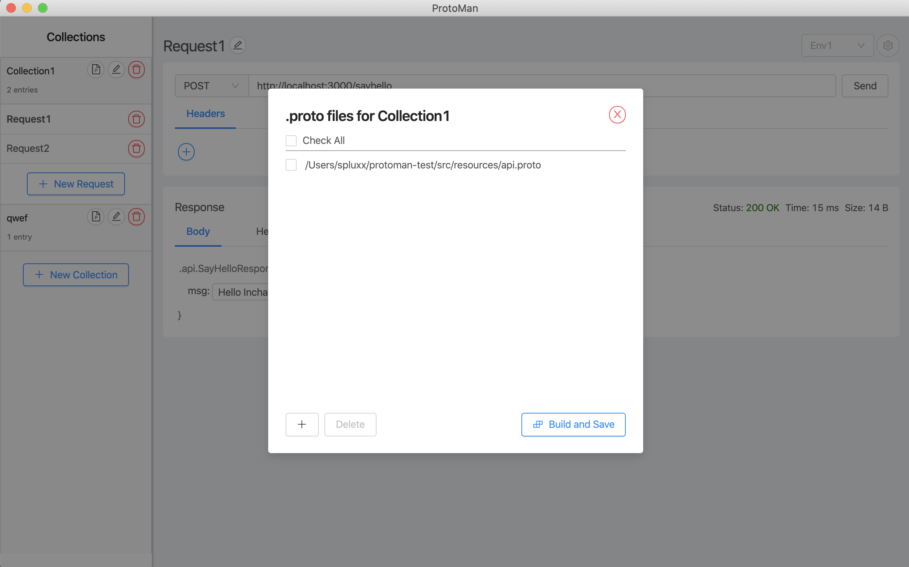
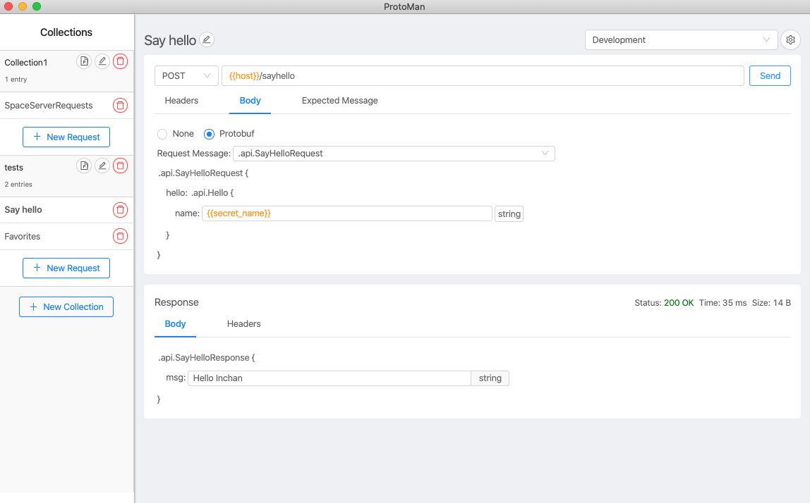

# Protoman

A [Postman](https://www.postman.com/)-like API client for [protobuf](https://developers.google.com/protocol-buffers)-based messages.

## Specs

- [x] Parsing .proto files to collect metadata.
- [x] UI to view/edit protobuf messages.
- [x] Sending requests with protobuf messages.
- [x] Viewing response with protobuf messages.
- [x] Persisting view state
- [x] Collections
- [ ] Environments from [Postman](https://learning.postman.com/docs/postman/variables-and-environments/variables/)
- [x] Response metadata - execution time, body size, ...
- [ ] Expose more request configurations
- [ ] Support bytes datatype - with something like base64 strings.

## Usage

1. **Register your .proto files to enable protobuf-related features. By clicking on the button with  icon next to your collection to register the file paths.**

2.  **The rest of the request-building interface is similar to Postman.**

    a. Enter your good old http request parameters (method, url, headers)

    b. Select request/response proto messages you want.

    c. Fill out the fields in your request proto message.

    d. Click send.

    e. The response is shown below the request section.

3. **That's it for the current version. Enjoy and leave a star if you like it !**

## Installation

### Mac
[Protoman-0.1.1.dmg](http://protoman.co/mac/Protoman-0.1.1.dmg)

### Windows
[Protoman Setup 0.1.1.exe](http://protoman.co/win/Protoman%20Setup%200.1.1.exe) - Unlike mac, I don't currently own a license to sign the app. So it might give you some security warnings!

### Linux
[Protoman-0.1.1.AppImage](http://protoman.co/linux/Protoman-0.1.1.AppImage)

As a fallback, you can clone the repo and run npm install && npm run build to build, and npm run start to launch the app. Or, you can actually find configurations on [electron builder](https://www.electron.build/) to get the right distribution version yourself!

## Contributing

If you are interested in reporting/fixing issues and contributing directly to the codebase, follow the standard procedures.

1. Create an issue.
2. Fork the repo.
3. Submit a PR.
4. We'll get back to you as soon as we can!

Make sure to run `npm run lint` before submitting your PR!

## Licence

[MIT](LICENSE.txt)
