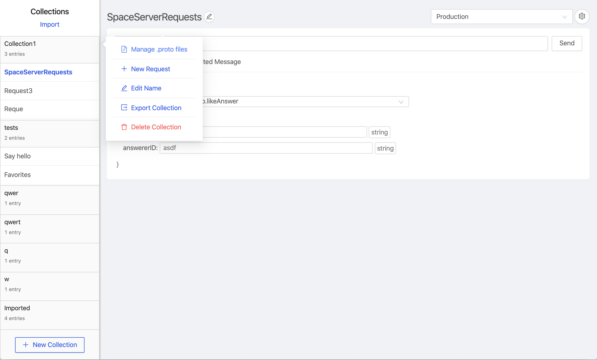
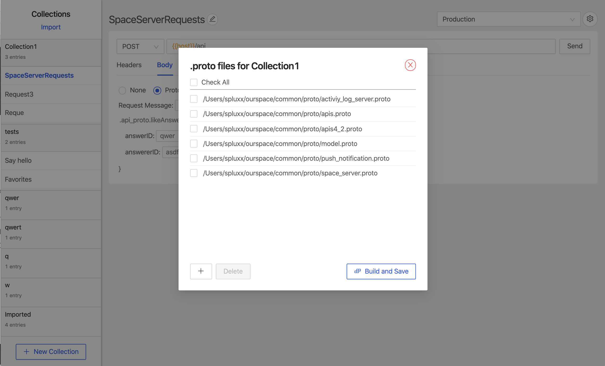
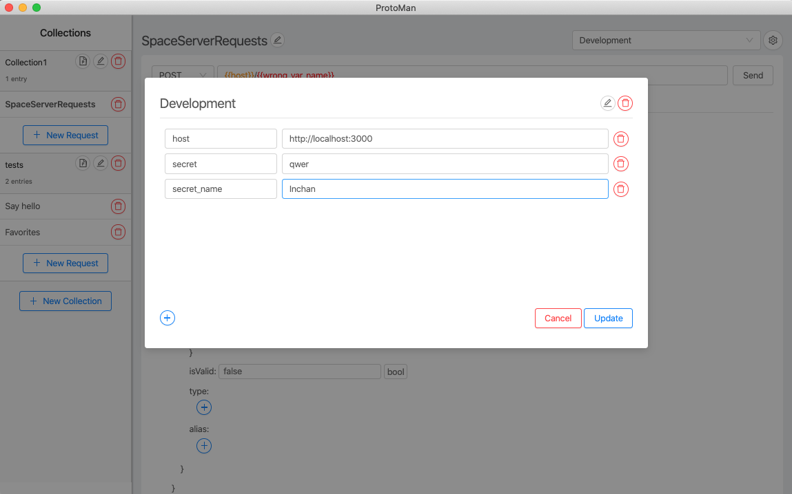
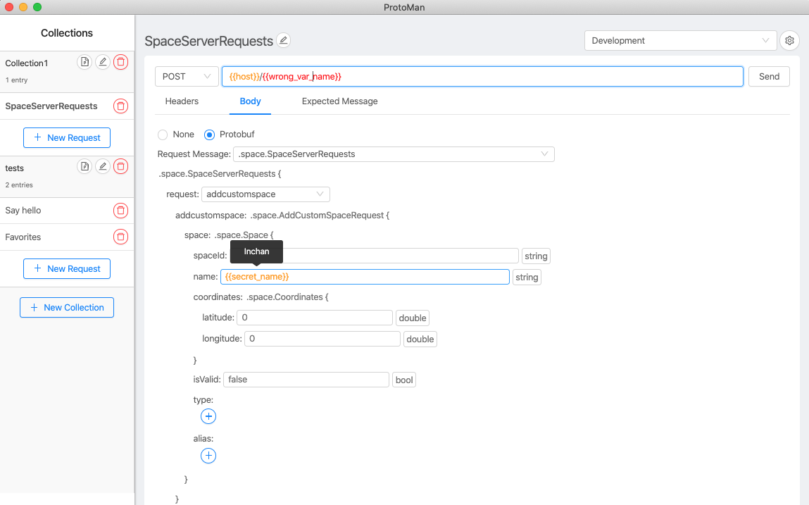

# Protoman

A [Postman](https://www.postman.com/)-like API client for [protobuf](https://developers.google.com/protocol-buffers)-based messages.

## Usage

1. **Register your .proto files to enable protobuf-related features. Right click on the collection, select 'Manage .proto files' to register the file paths.**

2.  **The rest of the request-building interface is similar to Postman.**

    a. Enter your good old http request parameters (method, url, headers)

    b. Select request/response proto messages you want.

    c. Fill out the fields in your request proto message.

    d. Click send.

    e. The response is shown below the request section.

3. **As of version 0.2.0, you can also set up environments, and reuse variables there throughout your requests on the top-right corner!**

4. **As of version 0.3.0, you can also import / export collections as JSON**

- When importing a collection, all the proto definitions / path to .proto files are also imported. Hence, it's recommended to fix the paths to keep the proto definitions up-to-date.
- Note that it's not compatible with Postman collections.

5. **As of version 0.4.0, you can also reorder requests / set different expected messages for success(2XX) and failures(others)**

6. **That's it for the current version. Enjoy and leave a star if you like it !**

## Installation

### Mac

[Protoman-0.4.0.dmg](https://github.com/spluxx/Protoman/releases/download/v0.4.0/Protoman-0.4.0.dmg)

### Windows

[Protoman Setup 0.4.0.exe](https://github.com/spluxx/Protoman/releases/download/v0.4.0/Protoman.Setup.0.4.0.exe) - Unlike mac, I don't currently own a license to sign the app. So it might give you some security warnings!

### Linux

[Protoman-0.4.0.AppImage](https://github.com/spluxx/Protoman/releases/download/v0.4.0/Protoman-0.4.0.AppImage)

As a fallback, you can clone the repo and run npm install && npm run build to build, and npm run start to launch the app. Or, you can actually find configurations on [electron builder](https://www.electron.build/) to get the right distribution version yourself!

### Manual build
- `yarn install`
- `yarn build`

### Debug
- `yarn dev` - start dev process, dont kill it!
- `yarn start` - start client

## Contributing

If you are interested in reporting/fixing issues and contributing directly to the codebase, follow the standard procedures.

1. Create an issue.
2. Fork the repo.
3. Submit a PR.
4. We'll get back to you as soon as we can!

Make sure to run `npm run lint` before submitting your PR!

## Licence

[MIT](LICENSE.txt)
